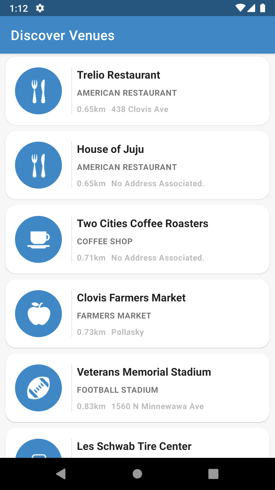
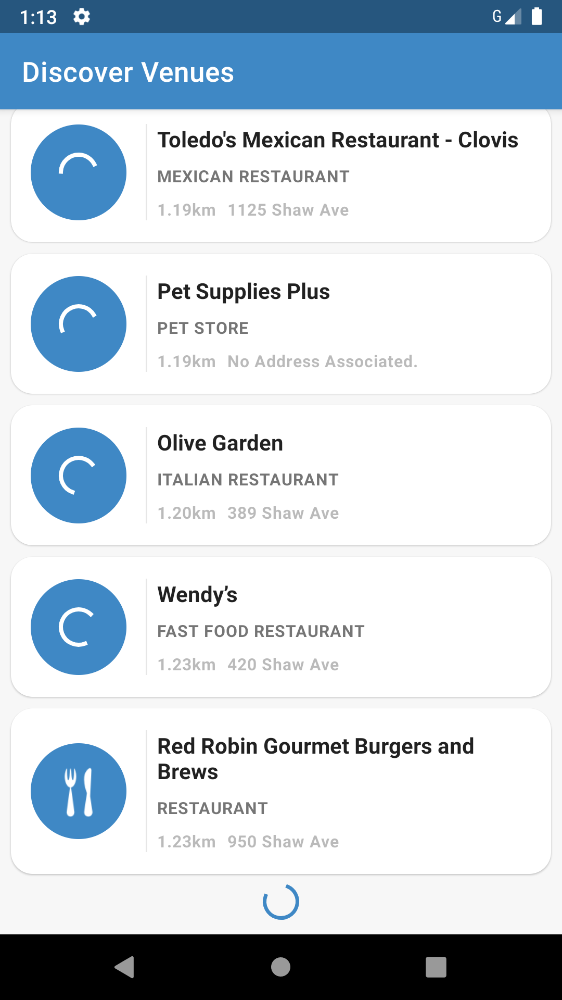
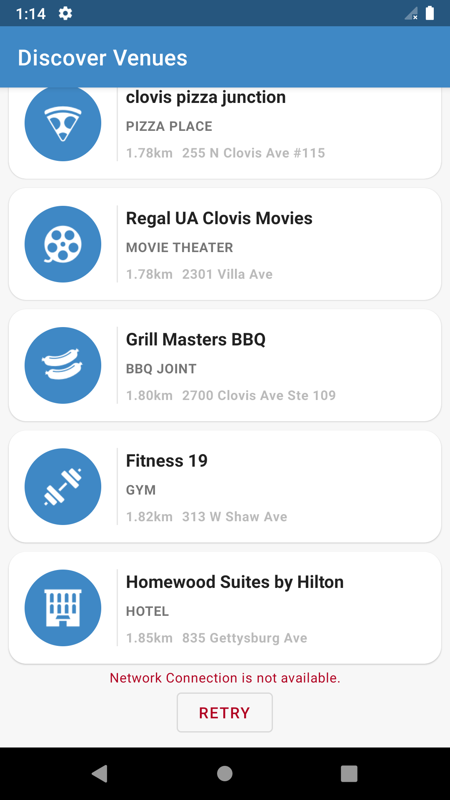
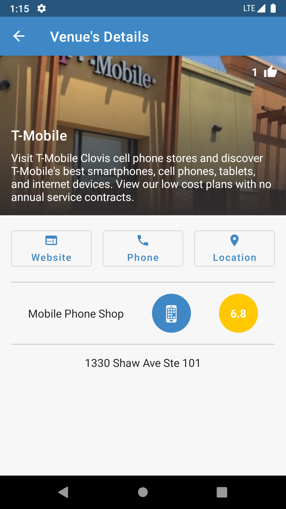
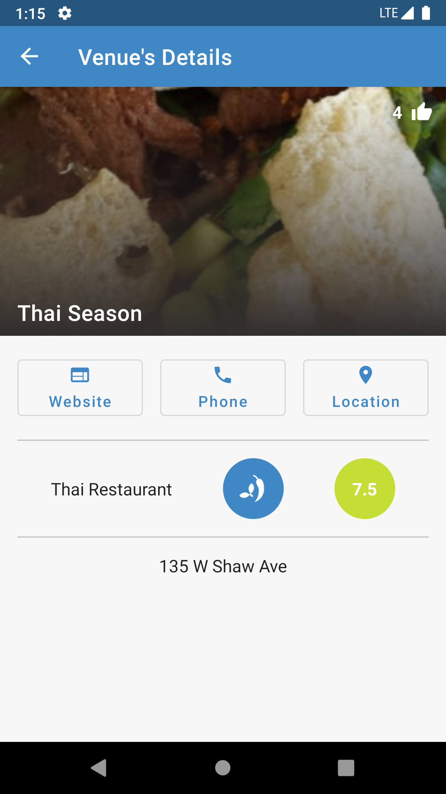
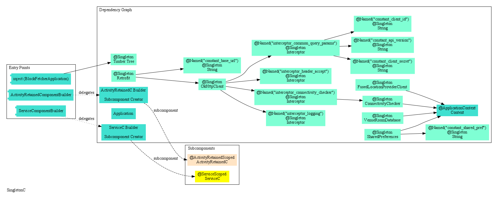
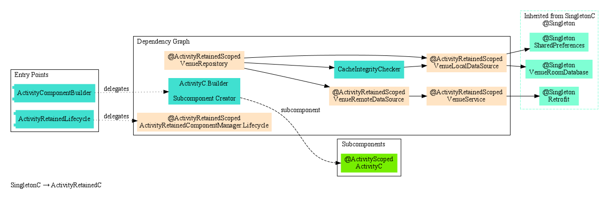
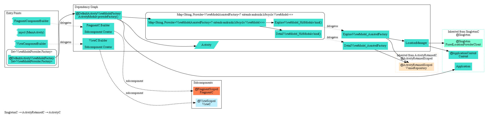
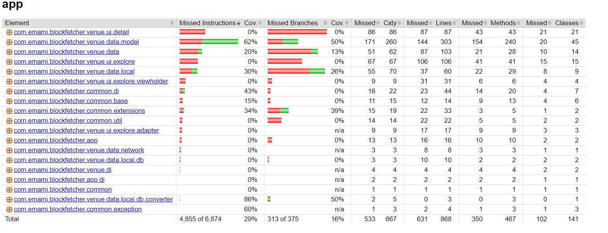

# Block Fetcher

Block Fetcher is a simple app that shows nearby places to the user and is leveraging Foursquare public Api.

# Screenshots

| Idle              | Loading More              | Error, Retry              | Detail Example 1              | Detail Example 2              |
| -------------- | -------------- | -------------- | -------------- | -------------- |
|     |     |     |     |     | 

# Tools & Libs

|  |  |
| ------ | ------ |
| **Language** | Kotlin |
| **Patterns** | MVVM, Repository, UDF |
| **Packaging** | Feature-Based |
| **Concurrency, Reactive Streams** | Coroutine, StateFlow, SharedFlow |
| **Networking & Serialization** | Retrofit, Okhttp, Gson |
| **Unit Testing (29% code coverage)** | Junit4, Mockito, MockWebServer |
| **Static Code Analyzing, Formatting** | Jacoco, Detekt |
| **Dependency Injection** | Dagger-Hilt |
| **Caching** | Room, Preferences |
| **Styling** | MaterialDesign(theming, color, typography) |

# Dependency Graph
**1_SingletonComponent, Objects that may live through the whole lifecycle of the app**

#
**2_ActivityRetainedComponent, Objects that may live through configuration changes**

#
**3_ActivityComponent, Objects that may live through activity's normal lifecycle**

# Unit Test Coverage Report

